# `pypsa-invopt` — Full life-cycle diagram

End-to-end flow from a `pypsa.Network` + observation DataFrame to every
artefact the package produces. Every node names the file, the function,
and (where applicable) the governing equation. Output-shape labels say
exactly what comes back.

```mermaid
flowchart TD
    %% ===================== INPUTS =====================
    subgraph INPUTS["INPUTS"]
        direction TB
        IN_NET["<b>network</b> : pypsa.Network<br/>buses · generators · lines · links<br/>storage_units · stores · loads · carriers<br/>global_constraints · snapshots"]
        IN_OBS["<b>observations</b> : pandas.DataFrame<br/>index = DatetimeIndex<br/>columns:<br/>price_&lt;bus&gt; (required)<br/>flow_&lt;line&gt; · dispatch_&lt;gen&gt;<br/>storage_dispatch_/store_/soc_&lt;s&gt;<br/>link_dispatch_&lt;l&gt; · store_dispatch_&lt;s&gt;<br/>mu_line_&lt;l&gt; · mu_gen_max_/min_&lt;g&gt;<br/><br/><i>build via:</i><br/>pio.observations_from_pypsa(solved_net)<br/>or pio.load_entso_e(zone, start, end)"]
        IN_PRE["<b>pre-flight (optional)</b><br/>pio.validate_observations(obs, ...)<br/>→ raises InvoptInputError on missing cols<br/>pio.assess_data_quality(obs)<br/>→ DataQualityReport (gaps · spikes · cov.)"]
        IN_KW["<b>kwargs</b><br/>formulation · solver · active_set_tol<br/>verbose · recover_line_params<br/>lambda_reg · obs_sigma<br/>prior_costs · storage_prior_costs"]
    end

    %% ===================== CALIBRATE =====================
    IN_NET --> CAL_ENTRY
    IN_OBS --> CAL_ENTRY
    IN_KW  --> CAL_ENTRY

    subgraph CAL["STAGE 1 — calibrate (calibration.py)"]
        direction TB
        CAL_ENTRY["calibrate(...)<br/>validate formulation choice"]
        CAL_READ["read_network(network)<br/><i>network.py</i><br/>→ InvoptNetworkData<br/>(buses, gens, lines, storage,<br/>links, stores, global_constraints,<br/>PTDF, emission_factor, p_max_pu(t))"]
        CAL_EXTRACT["_extract_observations(...)<br/><i>calibration.py</i><br/>→ obs_arrays = { prices, flows, dispatch,<br/>storage, link, store, mu_lines,<br/>mu_gens_upper/lower }"]
        CAL_AS["_detect_active_sets(...)<br/><i>calibration.py</i> →<br/>detect_active_sets_temporal<br/><i>utils/active_set.py</i><br/>• if μ_* supplied → KKT-exact<br/>• else  |flow| ≥ s_nom − ε<br/>• offline mask: p_max ≤ ε excluded<br/>(Liang-Dvorkin 2023 Alg.1)"]
        CAL_CLUSTER["cluster_active_sets(...)<br/><i>utils/active_set.py</i><br/>→ K unique patterns (ASTB)"]
        CAL_COLLAPSE{"intertemporal?<br/>storage / store / link /<br/>global_constraint present?"}
        CAL_SINGLE["collapse to 1 batch<br/>union of all patterns<br/>(cyclic SOC + CO2 cap<br/>break snapshot independence)"]
        CAL_MULTI["keep K batches"]

        subgraph CAL_QP["per-batch QP solve  —  _solve_one_batch (calibration.py)"]
            direction TB
            QP_BUILD["NoisyFormulation.build_model<br/><i>formulations/noisy.py</i>"]
            QP_LAY["_Layout — index map for<br/>r · c · c_q · λ · μ · ν · ξ · μ_global<br/>+ storage / link / store blocks"]
            QP_KKT["<b>_build_kkt_equality</b><br/><i>noisy.py</i><br/>EQ-1 (generator stationarity, per (g,t)):<br/>r − c − 2·p_obs·c_q + λ_bus(g)<br/>− Σ_ℓ PTDF·μ_ℓ − ν·1_max + ξ·1_min<br/>− Σ_gc (e_g·w_t)·μ_co2 = 0"]
            QP_STO["_build_storage_kkt (noisy.py)<br/>cyclic SOC stationarity<br/>per (s, t)"]
            QP_LNK["_build_link_kkt (noisy.py)<br/>c_link + λ_bus0 − η·λ_bus1<br/>+ μ_link = 0"]
            QP_STR["_build_store_kkt (noisy.py)<br/>energy-store stationarity"]
            QP_OBJ["<b>_build_objective</b> (noisy.py)<br/>min  ½||r||² + λ_reg·||θ − θ_prior||²<br/>+ (1/2σ²)·||λ̂ − price_obs||²"]
            QP_BND["<b>_build_bounds</b> (noisy.py)<br/>c ≥ 0 · c_q ≥ 0 · ν ≥ 0 · ξ ≥ 0<br/>μ ≥ 0 on congested<br/>μ_co2 ≥ 0"]
            QP_SOL["HiGHS sparse QP<br/><i>solvers/__init__.py</i><br/>→ x* (full primal vector)"]
            QP_REC["extract_costs / extract_duals<br/><i>noisy.py</i><br/>→ θ_batch + ||r||₂"]
            QP_BUILD --> QP_LAY --> QP_KKT --> QP_STO --> QP_LNK --> QP_STR --> QP_OBJ --> QP_BND --> QP_SOL --> QP_REC
        end

        CAL_BLUE["_blue_aggregate (calibration.py)<br/>θ̂ = Σ_k w_k·θ_k  /  Σ_k w_k<br/>w_k = T_k / σ²_k  (inverse-variance BLUE)"]
        CAL_LINE{recover_line_params?}
        CAL_LINEP["_recover_line_parameters<br/><i>calibration.py</i><br/>closed-form s_nom + IPOPT NLP on x<br/>(via utils/susceptance.py)"]
        CAL_RES["return <b>InverseResult</b><br/><i>results.py</i>"]

        CAL_ENTRY --> CAL_READ --> CAL_EXTRACT --> CAL_AS --> CAL_CLUSTER --> CAL_COLLAPSE
        CAL_COLLAPSE -- yes --> CAL_SINGLE --> CAL_QP
        CAL_COLLAPSE -- no  --> CAL_MULTI  --> CAL_QP
        CAL_QP --> CAL_BLUE --> CAL_LINE
        CAL_LINE -- true  --> CAL_LINEP --> CAL_RES
        CAL_LINE -- false --> CAL_RES
    end

    OUT_RES["<b>InverseResult</b>  (dataclass, results.py)<br/>theta_hat     : dict[str, float]<br/>rmse          : float (EUR/MWh)<br/>kkt_residuals : ndarray, shape (T,)<br/>active_set    : dict[int, dict[str, list[str]]]<br/>solver_status : 'optimal' &#124; 'feasible' &#124; 'infeasible'<br/>formulation   : str<br/>warnings      : list[str]<br/>n_active_sets : int (K)<br/>wall_time_s   : float"]
    CAL_RES --> OUT_RES

    %% ===================== APPLY =====================
    OUT_RES --> APPLY
    IN_NET  --> APPLY
    subgraph APPLY_BOX["STAGE 2 — apply_result (network.py)"]
        direction TB
        APPLY["parse keys gen:&lt;g&gt;:marginal_cost,<br/>gen:&lt;g&gt;:marginal_cost_quadratic,<br/>storage:&lt;s&gt;:marginal_cost,<br/>link:&lt;l&gt;:marginal_cost,<br/>store:&lt;s&gt;:marginal_cost,<br/>global_constraint:&lt;gc&gt;:mu,<br/>line:&lt;l&gt;:susceptance<br/>→ write back into network in place"]
    end
    APPLY --> OUT_APPLIED["<b>network</b> (mutated in place)<br/>now carries recovered costs"]

    %% ===================== POSTERIOR =====================
    OUT_RES --> POS
    IN_NET  --> POS
    IN_OBS  --> POS
    subgraph POS_BOX["STAGE 3 — posterior (bayes/laplace.py)"]
        direction TB
        POS["laplace_posterior(network, observations,<br/>result, prior_std=σ_p, obs_std=σ_o)"]
        POS_NLP["_make_neg_log_posterior<br/>U(θ) = (1/2σ_o²)·||λ(θ) − λ_obs||²<br/>+ (1/2σ_p²)·||θ − θ̂||²"]
        POS_HESS["_compute_hessian<br/>H = ∂²U/∂θ²   (analytic + finite-diff)"]
        POS_INV["_invert_precision<br/>Σ_post = (H + diag(1/σ_p²))⁻¹"]
        POS --> POS_NLP --> POS_HESS --> POS_INV
    end
    POS_INV --> OUT_POS["<b>PosteriorResult</b><br/>method='laplace'<br/>mean : dict[str, float]<br/>cov  : ndarray (p, p)<br/>parameter_order : tuple[str,...]<br/>samples=None · arviz_data=None"]

    %% ===================== IDENTIFIABILITY =====================
    OUT_POS --> IDF
    subgraph IDF_BOX["STAGE 4 — identifiability (identifiability.py)"]
        direction TB
        IDF["compute_identifiability(posterior,<br/>sigma_prior, sigma_threshold,<br/>min_information_gain, z_score)"]
        IDF_SIG["σ_post[i] = √Σ_ii  (Laplace)<br/>or empirical std (MCMC)"]
        IDF_GAIN["information_gain<br/>= 1 − σ_post / σ_prior<br/>(Brewer-Donovan 2018)"]
        IDF_CI["95 % CI = θ̂ ± z·σ_post<br/>(or 2.5/97.5 quantile for MCMC)"]
        IDF_FLAG["identifiable ⇔<br/>σ_post ≤ thr  AND<br/>gain ≥ min_gain"]
        IDF --> IDF_SIG --> IDF_GAIN --> IDF_CI --> IDF_FLAG
    end
    IDF_FLAG --> OUT_IDF["<b>report</b> : dict[str, ParameterIdentifiability]<br/>fields per key:<br/>sigma_post · sigma_prior · information_gain<br/>ci_low · ci_high · identifiable : bool · reason"]

    %% ===================== REFERENCE COSTS / WITHHOLDING =====================
    OUT_RES --> REF
    OUT_IDF --> REF
    subgraph REF_BOX["STAGE 5 — flag_withholding (reference_costs.py)"]
        direction TB
        REF["flag_withholding(theta_hat, generator_carriers,<br/>posterior_identifiability, fuel_prices,<br/>co2_price, heat_rates, emission_factors,<br/>variable_oms, z_threshold, absolute_threshold)"]
        REF_COST["compute_reference_cost (reference_costs.py)<br/>c_ref = fuel · HR  +  co2·e · HR  +  vom<br/>(NREL ATB 2024 / IEA WEO 2024 defaults;<br/>Birge-Hortaçsu-Pavlin 2017 §5)"]
        REF_FLAG["per-gen flag:<br/>standardised z = (c_rec − c_ref)/σ_post<br/>z &gt; +z_thr → withholding<br/>z &lt; −z_thr → distressed<br/>|z| ≤ z_thr → normal<br/>identifiable=False → unidentifiable"]
        REF --> REF_COST --> REF_FLAG
    end
    REF_FLAG --> OUT_FLAGS["<b>flags</b> : dict[str, WithholdingFlag]<br/>fields per gen:<br/>recovered · reference · deviation<br/>deviation_sigma · flag : str · reason : str"]

    %% ===================== HANDOFF =====================
    OUT_RES   -.-> HANDOFF
    OUT_POS   -.-> HANDOFF
    OUT_IDF   -.-> HANDOFF
    OUT_FLAGS -.-> HANDOFF

    HANDOFF["<b>HAND-OFF</b><br/>θ̂ + Σ_post + identifiability + withholding flags<br/>→ feed into the caller's own forward DCOPF /<br/>trading / asset-valuation pipeline.<br/>Forecasting and Monte-Carlo what-ifs are<br/>deliberately out of scope — companies have<br/>their own forecasting stacks; this package<br/>just gives them calibrated bids."]

    %% ===================== STYLING =====================
    classDef input    fill:#e8f4fd,stroke:#1f6fb4,stroke-width:1.5px,color:#0b2e4a;
    classDef stage    fill:#f1f8e9,stroke:#558b2f,stroke-width:1.5px,color:#1b3300;
    classDef output   fill:#fff3e0,stroke:#e65100,stroke-width:1.5px,color:#4a2200;
    classDef decision fill:#fce4ec,stroke:#ad1457,stroke-width:1.5px,color:#4a0027;
    classDef final    fill:#ede7f6,stroke:#4527a0,stroke-width:2px,color:#1a0033;

    class IN_NET,IN_OBS,IN_PRE,IN_KW input;
    class CAL_ENTRY,CAL_READ,CAL_EXTRACT,CAL_AS,CAL_CLUSTER,CAL_SINGLE,CAL_MULTI,CAL_BLUE,CAL_LINEP,CAL_RES,APPLY,POS,POS_NLP,POS_HESS,POS_INV,IDF,IDF_SIG,IDF_GAIN,IDF_CI,IDF_FLAG,REF,REF_COST,REF_FLAG,QP_BUILD,QP_LAY,QP_KKT,QP_STO,QP_LNK,QP_STR,QP_OBJ,QP_BND,QP_SOL,QP_REC stage;
    class OUT_RES,OUT_APPLIED,OUT_POS,OUT_IDF,OUT_FLAGS output;
    class CAL_COLLAPSE,CAL_LINE decision;
    class HANDOFF final;
```

## Symbols used in the equations

| Symbol | Meaning |
|---|---|
| `r[g,t]` | KKT residual (slack) on generator g at snapshot t |
| `c[g]`, `c_q[g]` | recovered linear / quadratic marginal-cost coefficients |
| `p_obs[g,t]` | observed dispatch (MW) |
| `λ[bus,t]` | bus marginal price (LMP) |
| `μ[ℓ,t]` | line-flow shadow price |
| `ν[g,t]`, `ξ[g,t]` | upper- / lower-bound generator duals |
| `μ_co2` | CO₂-cap shadow price (EUR/tCO₂) |
| `μ_link[ℓ,t]` | link upper-bound dual |
| `e_g`, `w_t` | generator emission factor, snapshot weight |
| `η` | link efficiency |
| `K`, `T`, `B`, `G` | n. active-set patterns, snapshots, buses, generators |
| `θ̂`, `Σ_post` | recovered parameter vector and posterior covariance |
| `σ_p`, `σ_o` | prior std on θ, observation noise std |

## Reading order

1. Run `calibrate(...)` — every kwarg shown in the INPUTS block flows
   into the green CALIBRATE stage. The orange box returned is the
   single source of truth for `theta_hat`.
2. `apply(...)` (Stage 2) is optional — it just writes `theta_hat`
   back into the live `pypsa.Network`.
3. Stages 3–5 are post-calibration diagnostics. Each one takes the
   `InverseResult` (or the `PosteriorResult` derived from it) and
   returns its own typed result object.
4. The dashed lines into the final purple node enumerate every
   actionable artefact the package produces: point estimate,
   posterior covariance, identifiability table, and withholding
   flags. Forecasting future markets and reliability Monte-Carlo
   are deliberately out of scope — the caller's own forward DCOPF
   pipeline consumes these artefacts.
